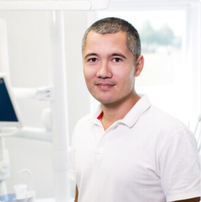

# User Personas

## Cecelia, 23

- **Bio: She's 23 and she's unemloyed. She is passionate of web-development.**
- **Needs/Goals: She wants improve her knowledge about web-development.**
- **Frustrations: She couldn't find a good training for studying
  web-development.**
- **Scenario 1: She wants to find a job after the training (web-development).**

---

## Douglas, 46

- **Bio: He's 46 and he's web-developer.**
- **Needs/Goals: He wants to change his career and become a teacher.**
- **Frustrations: He as a web-developer and he doesn't feel fullfield, now he
  wants to be a teacher.**
- **Scenario 2: He's looking for a way to become a teacher.**
